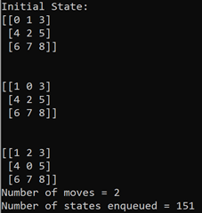

Instructions:

python homework1.py <algorithm_name> <input_file_path>\
where:\
algorithm_name can take one of the following values:
- dfs : For running the Depth-first search algorithm
- ids : For running the Iterative deepening search algorithm
- astar1 : For running the A* algorithm with heuristic 1.
- astar2 : For running the A* algorithm with heuristic 2.
input_file_path : Path of the file containing the space separated input state as a text file.\
For example - * 1 3 4 2 5 7 8 6\
\
Note that for input, * represents the empty tile, while during output 0 represents the empty tile\
\
Sample Input:\

\
Sample Output:\

\
\
Heuristics used:\
A*1: for each node n, cost = g*(n) + h*(n), where\
- g*(n) = depth of n\
- h*(n) = the number of tiles in n in incorrect positions\
\
A*2: for each node n, cost = g*(n) + h*(n), where\
- g*(n) = depth of n\
- h*(n) = the Manhattan distances of all tiles in n from their goal positions\
\
Analysis:\
For every input 8-puzzle I tried, these two heuristics preformed identically to each other, giving equivalent
solutions each time, and equal numbers of states enqueued. Based on my testing, it seems that in most cases,
the raw number of incorrect tiles and the manhattan distances between each tile and it's goal may be too closely
correlated to give a significant difference in finding the solution.
